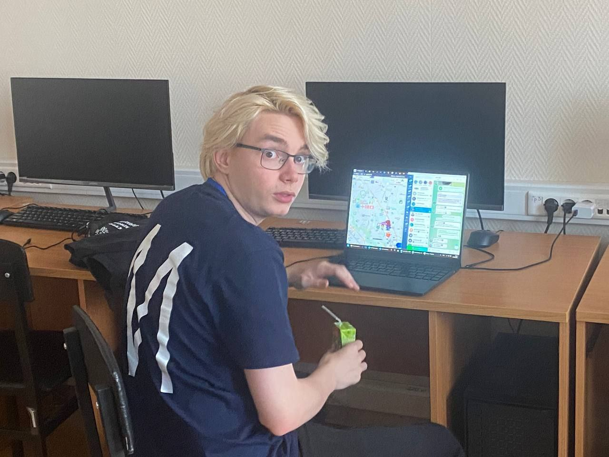

## Кластеризация минимумов рельефа (Streamlit)



Интерактивное приложение на Streamlit для анализа 3D‑точек рельефа, обнаружения локальных минимумов, вычисления геометрических признаков, кластеризации минимумов и экспорта результатов (CSV, изображения и PDF‑отчёт).

### Возможности
- **Загрузка CSV** со столбцами `X, Y, Z` 
- **Автопредложение масштаба** через медиану расстояния до ближайшего соседа
- **Геометрические признаки**: глубина, оценка/счёт бассейна, градиент, кривизны, ориентация
  - Плюс «киллер»-набор: главные кривизны (k1,k2), shape_index, curvedness, многошкальные версии (depth_r2, mean_grad_r2, H_r2, K_r2)
- **Поиск локальных минимумов** по радиусу или k‑ближайшим
- **Кластеризация**: KMeans, DBSCAN, Agglomerative, GMM (с выбором признаков)
- **Визуализации**: 2D тепловая карта (matplotlib) и интерактивная 3D поверхность (Plotly)
  - **Водораздел (опция)** для более точной площади бассейнов и карта бассейнов
- **Экспорт**: CSV минимумов, PDF‑отчёт, ZIP (CSV + изображения + параметры)
- **Киллер‑фича: автоподбор по силуэту** — автоматический перебор нескольких алгоритмов и параметров с выбором лучшего результата

### Требования
- Python 3.10+
- Зависимости перечислены в `requirements.txt`:
  - `streamlit`, `pandas`, `numpy`, `scipy`, `scikit-learn`, `scikit-image`, `plotly`, `matplotlib`, `seaborn`, `fpdf`, `kaleido`

### Установка
```bash
# 1) Виртуальное окружение
python3 -m venv .venv
source .venv/bin/activate  # Windows: .venv\\Scripts\\activate

# 2) Зависимости
pip install --upgrade pip
pip install -r requirements.txt
```

### Запуск (локально)
```bash
streamlit run app.py
```
Откройте адрес из терминала (обычно `http://localhost:8501`).

### Запуск в Docker
```bash
# Собрать образ
docker build -t mipt-terrain-clustering .

# Запустить контейнер
docker run --rm -p 8501:8501 mipt-terrain-clustering

# Или через docker-compose
docker compose up --build
```
После запуска откройте `http://localhost:8501`.

### Формат входного CSV
- Файл должен содержать числовые столбцы `X`, `Y`, `Z` (регистр и пробелы в заголовках не важны)
- Загрузчик (`utils.load_and_prepare`) приводит имена к верхнему регистру и отбрасывает нечисловые строки

Минимальный пример (`data.csv`):
```csv
X,Y,Z
0.0,0.0,10.2
0.5,0.0,10.1
0.0,0.5,10.3
0.5,0.5,10.0
```

### Типовой сценарий
1) Загрузите CSV (`X,Y,Z`).
2) В сайдбаре проверьте предложенный масштаб (медиана расстояния).
3) При необходимости скорректируйте `R`/`R_basin` и нажмите «Рассчитать признаки и минимумы».
4) Выберите алгоритм и признаки, затем «Запустить кластеризацию», или используйте «Автоподбор».
5) Оцените размер кластеров и метрику силуэта.
6) Просмотрите 2D/3D визуализации; при необходимости включите водораздел.
7) Скачайте CSV / PDF / ZIP.

### Элементы управления (сайдбар)
- **Масштаб и признаки**
  - `Множитель R`: радиус соседства \(R = фактор \times median\_NN\)
  - `Множитель R_basin`: радиус для оценки площади бассейна
  - `Минимум соседей (резерв)`: k при разрежённости точки
  - `Доля глубины для бассейна`: порог включения точки в бассейн
  - Кнопка: «Рассчитать признаки и минимумы»
- **Кластеризация**
  - Алгоритмы: `KMeans | DBSCAN | Agglomerative | GMM`
  - Параметры: `k` (для KMeans/Agglomerative/GMM) или `eps`/`min_samples` (для DBSCAN)
  - Выбор признаков: из рассчитанных доступных
  - Кнопка: «Запустить кластеризацию»
- **Автоподбор**
  - Перебор `k` для KMeans/Agglomerative/GMM и `eps` для DBSCAN
  - Выбор лучшего по silhouette score и таблица лидеров
- **Визуализация**
  - Выбор палитр для поверхности и кластеров
  - Опция: «Рассчитать бассейны методом водораздела (точная площадь)»

### Параметры кластеризации и метрики
- **Стандартизация признаков**: перед любым алгоритмом используется `StandardScaler` (обнуление среднего и масштабирование по стандартному отклонению). Это критично для корректной работы KMeans/GMM/DBSCAN.
- **Алгоритмы и параметры**:
  - **KMeans** (`clustering.run_kmeans`): `n_clusters=k`, `n_init=10`, `random_state=42`. Метрика — евклидова в признаковом пространстве после стандартизации.
  - **AgglomerativeClustering** (`clustering.run_agglomerative`): `n_clusters=k`, связывание по умолчанию (`linkage='ward'` при совместимости с параметрами sklearn), метрика — евклидова.
  - **GaussianMixture (GMM)** (`clustering.run_gmm`): `n_components=k`, `covariance_type='full'` (по умолчанию), `random_state=42`.
  - **DBSCAN** (`clustering.run_dbscan`): `eps` (радиус плотности), `min_samples` (минимум точек в окрестности), метрика — евклидова.
- **Метрика силуэта (silhouette score)**: \( s = (b - a) / \max(a, b) \in [-1, 1] \), где \(a\) — средняя внутрикластерная дистанция до своих, \(b\) — минимальная средняя дистанция до соседнего кластера. Значения ближе к 1 лучше.
  - Для результатов DBSCAN «шум» с меткой `-1` исключается из расчёта силуэта.
  - Силуэт считается только если кластеров ≥ 2 и в них ≥ по 1 точке; иначе результат считается неопределённым.
- **Автоподбор (силуэт)** (`clustering.choose_param_by_silhouette`): перебираются параметры и выбирается лучший по среднему силуэту:
  - KMeans/Agglomerative/GMM: `k ∈ {2, …, k_max_auto}`
  - DBSCAN: `eps ∈ [eps_min, eps_max]` с шагом `eps_step`; `min_samples` фиксируется
  - Значения по умолчанию в интерфейсе: `k_max_auto=3` (ограничено числом минимумов), `eps_min=0.2`, `eps_max=1.2`, `eps_step=0.1`, `min_samples=4`.
- **Рекомендации по выбору признаков**: начните с `depth`, `basin_area_est`, `mean_grad`, `mean_curvature`, `gauss_curvature`, добавляйте `ori_sin`, `ori_cos` и многошкальные признаки при необходимости разделять формы.

### Выходные файлы
- **CSV минимумов**: `minima_with_features_clusters.csv`
- **PDF‑отчёт**: параметры, сводная таблица по кластерам, изображения
- **ZIP**: `minima.csv`, изображения (`heatmap.png`, `3d_surface.png`), `params.json`
  - При включённом водоразделе добавляется `watershed.png` (карта бассейнов)

### Как это работает
- `features.compute_geometric_features`:
  - Радиусные окрестности (`R`), резерв — k‑ближайших
  - Локальная аппроксимация поверхности (квадратичная/линейная), градиент и кривизны
  - Метрики: `depth`, `basin_count`, `basin_area_est`, `mean_grad`, `mean_curvature`, `gauss_curvature`, `orientation`
- `features.find_local_minima`:
  - Проверка строгого минимума по `Z` относительно соседей
- `clustering.*`:
  - Алгоритмы scikit‑learn, признаки предварительно стандартизируются
- `visualization.*`:
  - `grid_surface` на основе `scipy.interpolate.griddata`
  - 2D/3D графики с подсветкой кластеров; опционально водораздел
- `report.build_pdf_report`:
  - Генерация PDF с параметрами, таблицами и картинками

### Структура проекта
```
mipt/
  app.py                # UI Streamlit и оркестровка
  utils.py              # Загрузка/валидация CSV, медиана 
  features.py           # Признаки и поиск минимумов
  clustering.py         # Кластеризация (KMeans/DBSCAN/Agglomerative/GMM)
  visualization.py      # Сетка, 2D/3D графики, quiver
  eda.py                # Базовый EDA
  report.py             # PDF‑отчёт
  requirements.txt      # Зависимости
  relief_data.csv       # Пример данных (если есть)
  pgoto.jpg             # Изображение проекта
```

### Архитектура и алгоритмы (вкратце)
- **Загрузка и препроцессинг** (`utils.load_and_prepare`) — стандартизация колонок `X,Y,Z`, чистка нечисловых значений.
- **Оценка масштаба** (`utils.median_nn_distance`) — медиана расстояний до ближайших соседей, служит базой для выбора `R` и `R_basin`.
- **Инженерия признаков** (`features.compute_geometric_features`) — локальная аппроксимация поверхности (квадратичная/линейная), расчёт глубины минимума, площади/счёта бассейна, градиента, кривизн, ориентации; многошкальные и морфометрические признаки (shape_index, curvedness и версии на второй шкале).
- **Детекция минимумов** (`features.find_local_minima`) — строгие локальные минимумы по радиусу `R` или kNN.
- **Кластеризация минимумов** (`clustering.*`) — KMeans, DBSCAN, Agglomerative, GMM; стандартизация признаков; оценка метрики силуэта. Есть режим автоподбора параметров и алгоритма по силуэту.
- **Визуализация** (`visualization.*`) — интерполяция поверхности (`grid_surface`), 2D тепловая карта, интерактивная 3D‑поверхность, векторы градиента; опционально расчёт бассейнов методом водораздела (skimage) и отрисовка карты бассейнов.
- **Отчётность** (`report.build_pdf_report`) — PDF со сводными таблицами и изображениями (FPDF + шrifты DejaVu Sans), а также экспорт CSV/ZIP.

### Почему именно эти признаки для кластеризации
- **depth (глубина)**: измеряет выраженность локального минимума относительно соседей. Глубокие впадины (большая depth) отделяются от мелких ложбинок — полезно, чтобы группировать «существенные» и «незначительные» минимумы.
- **Площадь бассейна (\(\widehat{A}\)) и/или счёт точек в бассейне**: различает локальные узкие ямы и широкие чашеобразные впадины. Большая площадь — более протяжённые депрессии.
- **Градиент (\(\mathrm{mean\_grad}\))**: характеризует крутизну склонов вокруг минимума. Высокий градиент → крутые/резкие формы рельефа; низкий → пологие.
- **Кривизны (\(H, K\))**: описывают локальную форму. Знак \(K\) отличает чашеобразные (\(K>0\)), седловидные (\(K<0\)) и плоские (\(K\approx 0\)) области. \(H\) даёт среднюю «выпуклость/вогнутость». Это позволяет разделять по типу формы, а не только по масштабу.
- **Ориентация (\(\theta\)) → кодировка \(\sin\theta,\cos\theta\)**: учитывает направленность склонов/структур (анизотропию). Пара \((\sin\theta, \cos\theta)\) избегает проблем циклической природы угла и пригодна для алгоритмов с евклидовой метрикой.

По умолчанию для кластеризации используются признаки: `depth`, `basin_area_est`, `mean_grad`, `mean_curvature (H)`, `gauss_curvature (K)`, `ori_sin`, `ori_cos` (их можно менять в интерфейсе).
Также доступен расширенный многошкальный/морфометрический набор: `shape_index`, `curvedness`, `depth_r2`, `mean_grad_r2`, `mean_curvature_r2`, `gauss_curvature_r2`.

### Описание кластеров
- В интерфейсе после кластеризации выводится таблица с агрегированными метриками и кратким описанием каждого кластера.
- Описание формируется по правилам из категорий (низкий/средний/высокий) для глубины, площади бассейна, градиента и кривизн, а также со средним направлением ориентации (8-румбовая роза). Можно скачать JSON/CSV с описаниями.

### Лицензия
Проект распространяется по лицензии MIT. Полный текст — в файле `LICENSE` и продублирован ниже.

MIT License

Copyright (c) 2025 Daniil Gladyshev

Permission is hereby granted, free of charge, to any person obtaining a copy
of this software and associated documentation files (the "Software"), to deal
in the Software without restriction, including without limitation the rights
to use, copy, modify, merge, publish, distribute, sublicense, and/or sell
copies of the Software, and to permit persons to whom the Software is
furnished to do so, subject to the following conditions:

The above copyright notice and this permission notice shall be included in all
copies or substantial portions of the Software.

THE SOFTWARE IS PROVIDED "AS IS", WITHOUT WARRANTY OF ANY KIND, EXPRESS OR
IMPLIED, INCLUDING BUT NOT LIMITED TO THE WARRANTIES OF MERCHANTABILITY,
FITNESS FOR A PARTICULAR PURPOSE AND NONINFRINGEMENT. IN NO EVENT SHALL THE
AUTHORS OR COPYRIGHT HOLDERS BE LIABLE FOR ANY CLAIM, DAMAGES OR OTHER
LIABILITY, WHETHER IN AN ACTION OF CONTRACT, TORT OR OTHERWISE, ARISING FROM,
OUT OF OR IN CONNECTION WITH THE SOFTWARE OR THE USE OR OTHER DEALINGS IN THE
SOFTWARE.


